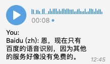

# VoiceRecogMiddleware: A middleware for EFB 

## Notice

**Middleware ID**: `catbaron.voice_recog`

**VoiceRecogMiddleware** is a middleware for EFB to recognize content of voice message.
This middleware is modified based on `ehForwarderBot 1.0`



- Baidu
    - API from Baidu is available for free. 
    - You need to get `API_KEY` and `SECRET_KEY` following
    http://ai.baidu.com/docs#/ASR-API-PRO/top
- Azure Cognitive Service
    - Azure Cognitive Service offers 5 audio hours per month for free.
    - You need to get `Key1` and `Endpoint` from https://portal.azure.com/
- IFlyTek
    - IFlyTek offers 500 queries per day fro free to new users. Additional free bundles are available from 50,000 queries/90 days to 100,000 queries/year.
    - You need to get `APPID`, `APISecret` and `APIKey` from https://console.xfyun.cn/services/iat
- Tencent
    - Tencent offers 15,000 queries for free per month.
    - Chinese ID verification is required to use free service.
    - You need to get `SecretID` and `SecretKey` from https://console.cloud.tencent.com/cam/capi
-  You need to use **VoiceRecogMiddleware** on top of
   [EFB](https://ehforwarderbot.readthedocs.io). Please check the
   document and install EFB first.

## Dependense
* Python >= 3.6
* EFB >= 2.0.0b15
* pydub

## Install and configuration

### Install 
```
git clone https://github.com/catbaron0/efb-voice_recog-middleware
cd efb-voice_recog-middleware
sudo python setup.py install
```

### Enable

Register to EFB
Following [this document](https://ehforwarderbot.readthedocs.io/en/latest/getting-started.html) to edit the config file. The config file by default is `$HOME/.ehforwarderbot/profiles/default`. It should look like:

```yaml
master_channel: foo.demo_master
slave_channels:
- foo.demo_slave
- bar.dummy
middlewares:
- foo.other_middlewares
- catbaron.voice_recog
```

You only need to add the last line to your config file.

### Configure the middleware

The config file by default is `$HOME/.ehforwarderbot/profiles/default/catbaron.voice_recog`.
Please create the config file if thers is not one.  Edit it as:

```yaml
speech_api:
    baidu:
        api_key: API_KEY
        secret_key: SECRET_KEY
        # supported language:
        #   zh, zh-x-en, en, zh-yue, zh-x-sichuan, zh-x-farfield
        lang: zh
    azure:
        key1: KEY_1
        endpoint: ENDPOINT
        # supported language:
        #   ar-EG, ar-SA, ar-AE, ar-KW, ar-QA, ca-ES,
        #   da-DK, de-DE, en-AU, en-CA, en-GB, en-IN,
        #   en-NZ, en-US, es-ES, es-MX, fi-FI, fr-CA,
        #   fr-FR, gu-IN, hi-IN, it-IT, ja-JP, ko-KR,
        #   mr-IN, nb-NO, nl-NL, pl-PL, pt-BR, pt-PT,
        #   ru-RU, sv-SE, ta-IN, te-IN, zh-CN, zh-HK,
        #   zh-TW, th-TH, tr-TR
        lang: zh
    tencent:
        secret_id: SECRET_ID
        secret_key: SECRET_KEY
        # supported language: en, zh
        lang: en
    iflytek:
        app_id: APP_ID
        api_secret: API_SECRET
        api_key: APP_KEY
        # supported language: zh, en
        lang: en
auto: true
```

Replace the section with all-caps to your own ones.

Note that you may omit the section that you do not want to enable.

---
Turn off `auto` if you want to disable auto recognition to all voice
messages. Alternatively, you may reply <code>recog`</code> to a voice
message to recognise it.

### Restart EFB.
