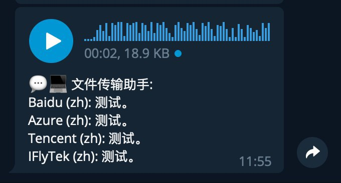

# VoiceRecogMiddleware: A middleware for EFB 

## Notice

**Middleware ID**: `catbaron.voice_recog`

**VoiceRecogMiddleware** is a middleware for EFB to recognize content of voice message.
This middleware is modified based on `ehForwarderBot 1.0`



- Baidu
    -  API from Baidu is available for free. 
    -  You need to get `API_KEY` and `SECRET_KEY` following
    http://ai.baidu.com/docs#/ASR-API-PRO/top
- Azure Cognitive Service
    - Azure Cognitive Service offers 5 audio hours per month for free.
    - You need to get `Key1` and `Endpoint` from https://portal.azure.com/
-  You need to use **VoiceRecogMiddleware** on top of
   [EFB](https://ehforwarderbot.readthedocs.io). Please check the
   document and install EFB first.

## Dependense
* Python >= 3.6
* EFB >= 2.0.0b15
* pydub

## Install and configuration

* Install 
```
git clone https://github.com/catbaron0/efb-voice_recog-middleware
cd efb-voice_recog-middleware
sudo python setup.py install
```
* Register to EFB
Following [this document](https://ehforwarderbot.readthedocs.io/en/latest/getting-started.html) to edit the config file. The config file by default is `$HOME/.ehforwarderbot/profiles/default`. It should look like:

```
master_channel: foo.demo_master
slave_channels:
- foo.demo_slave
- bar.dummy
middlewares:
- foo.other_middlewares
- catbaron.voice_recog
```

You only need to add the last line to your config file.

* Config the middleware

The config file by default is `$HOME/.ehforwarderbot/profiles/default/catbaron.voice_recog`.
Please create the config file if thers is not one.  Edit it as:

```
speech_api:
    baidu:
        api_key: API_KEY
        secret_key: SECRET_KEY
    azure:
        key1: KEY_1
        endpoint: ENDPOINT

language: zh
```

Replace the `API_KEY`, `SECRET_KEY`, `KEY_1` and `ENDPOINT` to your own.

Note that you may omit the section that you do not want to enable.

* Restart EFB.
